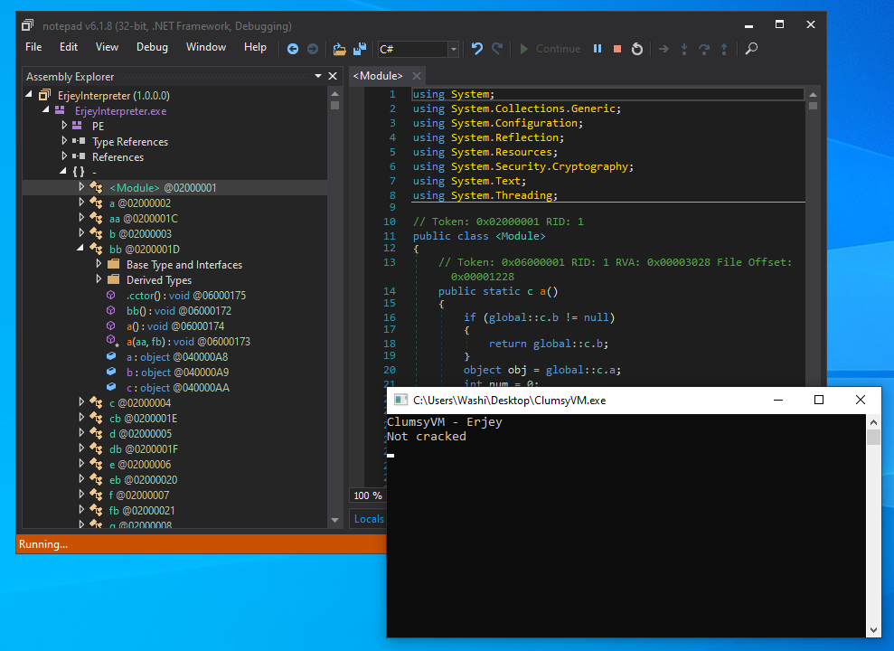
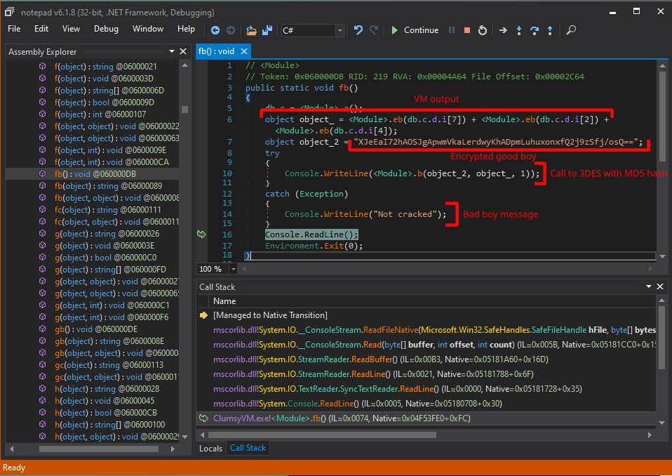
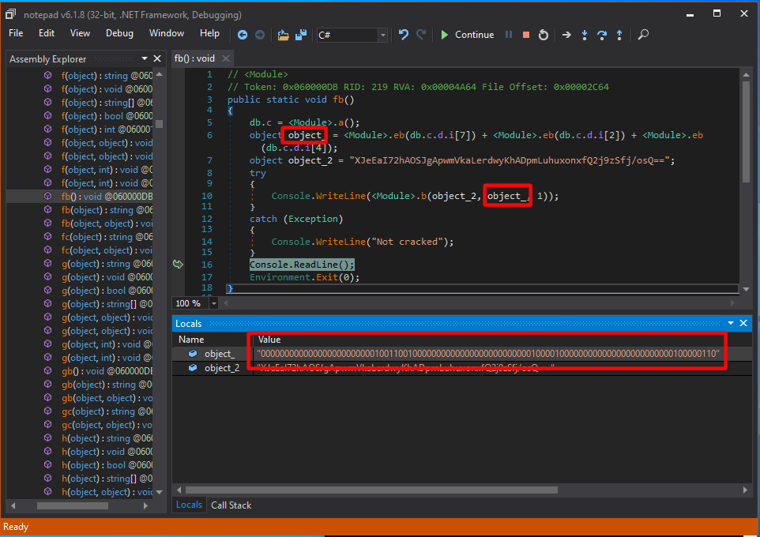
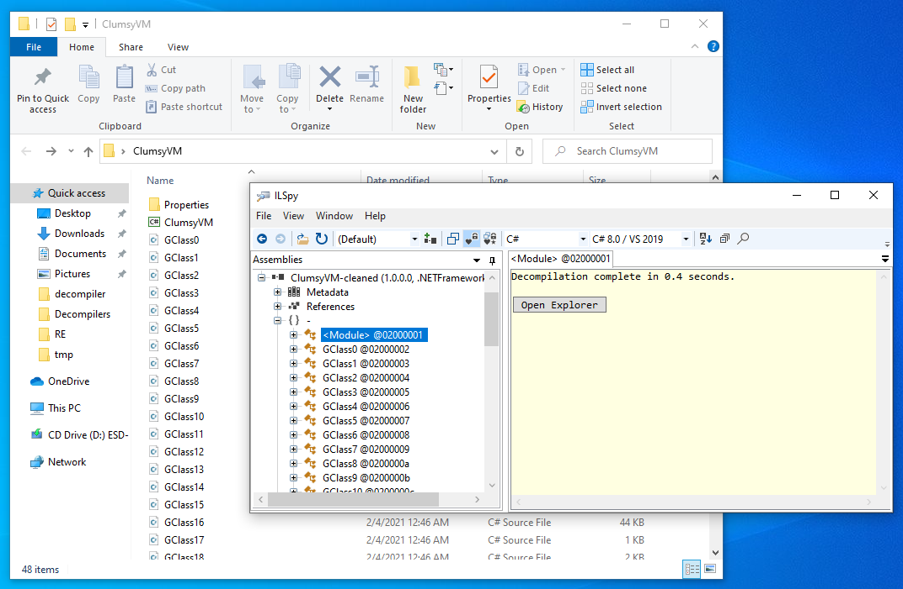

# ClumsyVM

**Author:** LoLLo90

**Thread link:** [https://forum.tuts4you.com/topic/42829-clumsyvm/](https://forum.tuts4you.com/topic/42829-clumsyvm/)

**Time spent:** About 1-2 days.

**Tools used:** dnSpy, ILSpy, JetBrains Rider

On Februari 1, a user by the name LoLLo90 posted a crackme challenge that has custom a virtual machine in it. It came with the following description:

```
This is my clumsy virtual machine 😃

Goals:

Bronze - Patch the crackme to show the correct message

Silver - Bronze + explain how the virtualized code works

Gold - Silver + write a totally different virtualized code to pass the check
```

I decided to make a write-up for this, since the virtual machine is definitely interesting and worth to write about :)

## Orientation

The first thing that you will notice when opening the binary is that it does not ask for any input. It simply states that it has not been cracked yet. Furthermore, when we open it in a tool like CFF explorer, we can quickly find out that this binary is a .NET application. Opening it in dnSpy reveals that some basic renaming obfuscation is applied, and that most of the methods are outlined into the `<Module>` type. We also see that the app is running fine with a debugger attached, so no tricks there :).



If we run the application with dnSpy attached, let the program print the bad boy message, and then hit pause, we can find the final verification method by going up the call stack and seeing which method triggered the call to **Console.ReadLine**:



Some quick analysis will tell us that the first local variable is assigned to some magic output values from what we can presume is the virtual machine. This is then followed by a call to `<Module>.b`, which does nothing more than hash this magic output with the MD5 hashing algorithm, and using the output as a decryption key for a hardcoded 3DES ECB encrypted message.

If we look into the locals window, we can see that the magic output seems to be some kind of binary string of 96 bits long:



This already tells us that getting the good boy message is not really possible without getting a proper output of the virtual machine. 96 bits is way too many bits to bruteforce on a normal computer. Also what you might notice is that the output does not change, no matter how many times you run the application. Furthermore, the binary does not ask for any input. This means that the virtual machine must compute something that we do not know yet, but is crucial to this decryption routine. Also I doubt this challenge is about breaking MD5 or 3DES, so the only thing that we can do is dive into the virtual machine and see what it is actually doing.

In other words, we must get the silver medal before we can get the bronze medal.


Maybe I missed something here, because that does not make sense to me. Anyway, I was not going to stop at the bronze medal anyways, so lets dive in!

## Initial deobfuscation

The first thing that I wanted to do, was to get an idea of how resilient this application is to modificiations. I started off by getting rid of all the clever name overloading by running it through trusty [de4dot](https://github.com/de4dot/de4dot) with a custom regex:

```bash
de4dot.exe ClumsyVM.exe --un-name "!^[a-zA-Z]\w*$"
```

Then I ran the output again, and saw that the same magical VM output binary string in the locals window. This is very good news, the program did not get affected at all!

While dnSpy is an amazing reverse engineering tool, and is great for quick patches, it is absolutely horrible when it comes to doing anything more substantial in my opinion, such as refactoring and simplifying code.

For this reason, I changed my strategy completely at this point, and switched to ILSpy. ILSpy has a far superiour decompiler engine, so good actually that it is possible to completely export the application as a full csproj without any syntax or semantic errors whatsoever! Kudos once again to the ILSpy team!



## Finding the initial state and main VM loop

The cool thing about it being exported as a csproj file, is that it can be opened in IDEs that have a plethora of refactorings built-in. Therefore, from this point onwards, I switched to JetBrains Rider. Let us start analysing!

From the main method we can infer some good things already:

```csharp
public static void Main(string[] string_0)
{
	MainVMType object_ = new MainVMType();
	Console.WriteLine("ClumsyVM - Erjey");
	MainModule.WrapImportMemory(object_, 0);
	MainModule.WrapStartMainLoop(object_, 0);
	Console.ReadLine();
}
```

The first method prepares the initial state of the virtual machine by importing a long bit string of 36bit integers into an array. From now on, we will be calling this chunk of memory `VMMemory`. Interestingly to note is that it seems that the `VMMemory` type is actually initialized with very similar of not the same chunk of memory, which is then overrided by a method which I called `ImportMemory`:

```csharp
public class VMMemory
{
	public static readonly object LockObject = new object();
	public static volatile VMMemory Instance;
	public string[] Array;

	public VMMemory()
	{
		MainModule.SetArray(this, new string[512]);
		MainModule.GetArray(this)[0] = "000000110000000000000000000000001001";
		MainModule.GetArray(this)[1] = "010111100000000000000000000000001001";
		MainModule.GetArray(this)[2] = "000000000000000000000000000000000000";
		MainModule.GetArray(this)[3] = "000000000000000000000000000000000000";
		MainModule.GetArray(this)[4] = "000000000000000000000000000000000000";
		/* ... A bunch more of these ... */
    }
}

...

public static void WrapImportMemory(MainVMType vm, int int_9)
{
	ImportMemory(vm.State1, 0);
}

public static void ImportMemory(VMType1 object_7, int int_9)
{
	object obj =
		"000000110000000000000000000000001001\r\n010111100000000000000000000000001001\r\n000000000000000000000000000000000000\r\n000000000000000000000000000000000000\r\n000000000000000000000000000000000000\r\n000000000000000000000000000000000000\r\... (trimmed for brevity)";
	ImportMemory(object_7.object_2, ((string) obj).Split(new char[1]
	{
		'\n'
	}));
}

public static void ImportMemory(VMMemory dest, string[] data)
{
	for (int i = 0; i < 511; i++)
	{
		GetArray(dest)[i] = data[i];
	}
}

public static string[] GetArray(VMMemory object_7)
{
	return object_7.Array;
}
```

The second call in the main method runs the main VM loop. Here, we also see that a second chunk of memory is being initialized, in a similar fashion to the first memory chunk. However, this time the bit strings are 32-bits wide, and there seems to be some format that is used here. From now on, this memory is called `VMMemory2`, and we will revisit this format later. 

```csharp
public static void WrapStartMainLoop(MainVMType object_7, int int_9)
{
	ImportMemory2(object_7.State1, 0);
	StartMainVMLoop(object_7.State1);
}

public static void ImportMemory2(VMType1 object_7, int int_9)
{
	object obj =
		"@128\r\n00000000000000000000000000000000\r\n00000000000000000000000001000100\r\n00000000000000000000000001101001\r\n@0\r\n00000011000000000000000100000000\r\n00011001000100000101100101010111\r\n00000001000100000000000100010000\r\n00000001001101100101100101011100\r\n00000011000100000101100101010111\r\n00101100000100000011011100010000\r\n01011001010110010101011101011100\r\n00000001000101010000001000110110\r\n01010111101101100000001000010101\r\n00000010000100000101100101011001\r\n01011111010111110000001100110110\r\n00010101000001010000000110000100\r\n01011111000010100001000000000001\r\n00000010000101010101100101011111\r\n10000100000000010000000010111001\r\n00000011000101010111000000000011\r\n00000000000000001010011101100101\r\n00000000000000000000001100000000\r\n00000001000101010000000100010101\r\n00010101010110010101100101010111\r\n01011111010111110101111100000001\r\n01100101010111110101100101010111\r\n00010101011001010000001000010101\r\n00000010000101010110010100000001\r\n01100101100010000001000001100101\r\n00000010000000001011100101010111\r\n00000000000000110000000010101101\r\n00010101000000010001010100000000\r\n01100101000000010001000000000010\r\n01100101010110000001000001100101\r\n00000000000000000000000010101101";
	ImportMemory2(object_7.object_2, ((string) obj).Replace("\r", "").Split('\n'));
}

public static void ImportMemory2(object object_7, string[] object_8)
{
	InitializeMemory2(((VMState)object_7).memory2, object_8);
}

public static void InitializeMemory2(VMMemory2 object_7, string[] object_8)
{
	// not important right now for the story...
}
```

The actual main loop of the virtual CPU is quite simple. It just involves the creation of the CPU object, and an infinite loop that calls some virtual dispatched function.

```csharp
public static bool MainVMLoop(VMCpuWrapper vm)
{
	vm.cpu = GetOrCreateVMCpu();
	while (true)
	{
		FetchAndExecuteNext(vm.cpu);
	}
}

public static void FetchAndExecuteNext(VMCpu vm)
{
	vm.CurrentHandler.Execute(); // virtual dispatch.
}
```

## Reversing the CPU

How do you tackle such a challenge, where the opcodes of the virtual machine are completely unknown? To get a rough feeling of which opcode handlers are used in the virtualized code, I decided to modify this loop slightly, by adding a simple Console.WriteLine call that prints out the type of the current handler.


```csharp
public static bool MainVMLoop(VMCpuWrapper vm)
{
	vm.cpu = GetOrCreateVMCpu();
	while (true)
	{
		Console.WriteLine(vm.cpu.CurrentHandler.GetType().FullName);
		FetchAndExecuteNext(vm.cpu);
	}
}
```

You will quickly notice that the output starts off by one class, then is constantly switching between only two classes, and ends with one final class. 

```
GClass31
GClass29
GClass28
GClass29
GClass28
GClass29
GClass28
...
GClass29
GClass28
GClass28
GClass30
Not cracked
```
Does this VM only have four opcodes of which two opcodes are used the most? Is this some kind of esolang or something else is going on? 

It so turns out that we are not dealing with an instruction set, but rather with a state machine, and the virtual CPU keeps switching between the fetch and execute state. Quite similar to how a real CPU would do this! It seems that this virtual machine is a pretty low level software implementation of custom hardware. This also explains the raw bits being used for memory and the odd number of bits used per instruction (36 bits). 

For this reason, I renamed `CurrentHandler` to `CurrentAutomatonState`, and renamed the four handlers appropriately:

| Type     | New name  |
|----------|-----------|
| GClass31 | Start     |
| GClass29 | Fetch     |
| GClass28 | Execute   |
| GClass30 | End       |


## The Execute stage

We know so far that the CPU runs some kind of microcode stored in `VMMemory`, and that each instruction is 36 bits wide. Let's have a look at how these instructions are interpreted. Evidently, most of the magic happens in the `Execute` state of the virtual CPU. In particular in the following function, which I called `ExecuteInstruction`.

```csharp
public static void ExecuteInstruction(VMInternalState1 vm, string instruction)
{
	SetCurrentInstruction(vm, instruction);

	// Decode
	string bits_32_36 = instruction.Substring(32, 4);
	string bits_29_31 = instruction.Substring(29, 3);
	string bits_20_28 = instruction.Substring(20, 9);
	string bits_14_19 = instruction.Substring(14, 6);
	string bits_12_14 = instruction.Substring(12, 2);

	DoNothing4(vm);

	Set_Bits_32_36(vm.RegisterContainer, bits_32_36);
	LoadRegisterValue(vm.RegisterContainer);

	MoveLoadedRegisterValueIntoArg2OfALU(vm.RegisterContainer);
	IfRegisterIs1ThenSetArg1ToRegister(vm.Registers[9]);
	Set_Bits_14_19(vm.ALU, bits_14_19);
	DoALUOperation(vm.ALU);

	SetString0(vm.ShiftRotateUnit, bits_12_14);
	DoShiftOrRotate(vm.ShiftRotateUnit);

	SetString0(vm.object_3, bits_20_28);
	MoveResultIntoRegisters(vm.object_3);

	string reg0Value = GetValue(vm.Registers[0]);
	string reg1Value = GetValue(vm.Registers[1]);
	string reg2Value = GetValue(vm.Registers[2]);

	LoadReadMemoryIntoRegisters(vm);
	SetString0(vm.MMU, bits_29_31);
	string[] readOutput = DoReadWriteMemory(vm.MMU, reg0Value, reg1Value, reg2Value);

	Unused = 1818084011;
	vm.MemoryReadResult = readOutput;

	if (bits_29_31 != "000")
	{
		vm.LastReadWriteOperation = bits_29_31;
		vm.MemoryReadResultIsSet = true;
	}
}
```

Here we can see some pretty good indicators of how inefficient this virtual machine is :D. It uses strings for absolutely _everything_, including the parsing, operation selection and storing intermediate results. Especially in .NET, this is a really bad idea because strings are immutable. This means every string operation results in a new copy being made of the string, leading to a lot of strings being allocated on the actual heap. Of course, for the challenge it doesn't really matter, but don't do this when you are actually writing a commercial obfuscator/virtualizer :P.

We can also see a lot of redundent code. For example, notice the `DoNothing4`. Yes, this was the fourth static function that I analyzed that had an empty method body. Furthermore, the module type also stores a lot of unused fields, such as the one I called `Unused` in here. I have no idea why they are there, but we can ignore them.

From the beginning of this method, we can see the first 12 bits of the instruction are not interpreted in this VM state. The remaining bits are split up in 5 parts, which are then indivually moved into separate components of the virtual CPU. By carefully analyzing what happens in each of these functions and components, you will end up with the following format:

| Bits  | Meaning                 |
|------:|:----------------------- |
| 12-13 | ALU shift/rotate        |
| 14-19 | ALU bit operation       |
| 20-28 | Output registers        |
| 29-31 | Read/write memory       |
| 32-36 | Input register select   |

The main procedure of the execute stage can be summarized in the following steps:
- Load input registers.
- Move input registers or zeroes into the Arithmetic Logic Unit (ALU).
- Perform ALU bit operation if specified.
- Perform ALU shift operation if specified.
- Move read memory into the registers 1 or 3 if the previous cycle was a read operation
- Perform next memory read/write operation.

For input registers, we simply use the numerical value of the bits 32-36 as index, except there is a special rule for register 3 and 4. Register 9 is never used, and instead register 3 is loaded and sign extended or zero extended. The output registers field is a bitfield that selects all registers that the final result will be written to.

For ALU bit operations, we have the following options:

| Bits  | Meaning                                 |
|------:|:----------------------------------------|
| 14-15 | Operation AND, OR, NOT or ADD           |
| 16    | If 1 Then A = register "1" (=r9) Else 0 |
| 17    | If 1 Then B = input reg Else 0          |
| 18    | If 1 Then flip bits of A                |
| 19    | If 1 Then +1 Else +0                    |

| Bits 14-15 | Meaning  |
|-----------:|:---------|
| `00`       | `A AND B`|
| `01`       | `A OR B` |
| `10`       | `NOT B`  |
| `11`       | `A + B`  |

For ALU shift operations, we have the following options:

|Value | Meaning             |
|-----:|:--------------------|
| `00` | Nothing             |
| `10` | Shift left by 8     |
| `01` | Rotate right by one |
| `11` | Nothing             |

Finally, for read/write operations into the memory (`VMMemory2`), we have the following options:

| Bits | Meaning                           |
|-----:|:----------------------------------|
| 29   | If set, `mov dword [r0*4], r1`    |
| 30   | If set, `mov output0, dword [r0]` |
| 31   | If set, `mov output1, byte [r2]`  |


## The Fetch state

We still have 12 bits that we do not really know the purpose of. It so turns out these are used in the fetch state instead of the execute state. They play a key role in determining the next offset to read and execute at:

```csharp
public static void ComputeNextProgramCounter(FetchAutomatonState automatonState)
{
	// Read next PC from last instruction.
	string operand = GetCurrentInstruction(automatonState.VMCpu).Substring(1, 8);
	string reg3 = GetRegister3Value(automatonState.VMState).Substring(24, 8);

	// If flag 9 is set, add reg3 to the operand.
	string nextPC;
	if (GetCurrentInstruction(automatonState.VMCpu)[9] != '1')
	{
		nextPC = operand;
		char c = default(char);
		GClass3.Unused = c;
	}
	else
	{
		nextPC = ToBinary(Convert.ToInt32(operand, 2) | Convert.ToInt32(reg3, 2), 8);
	}

	// Interpret flags.
	int[] flags = GetFlags(automatonState.VMState);
	int parity = flags[0];
	int zero = flags[1];
	int paritySelect = Convert.ToInt32(GetCurrentInstruction((automatonState).VMCpu)[10].ToString(), 2);
	int zeroSelect = Convert.ToInt32(GetCurrentInstruction((automatonState).VMCpu)[11].ToString(), 2);
	int num5 = (parity & paritySelect) | (zero & zeroSelect);

	UnusedInt3 = zero;

	// Skip if parity or zero is set and selected in the instruction.
	int num6 = num5;
	num6 |= Convert.ToInt32(GetProgramCounter(automatonState.VMCpu)[0].ToString(), 2);

	VMCpu cpu = automatonState.VMCpu;
	string text = num6.ToString();

	UnusedInt4 = 796469985;

	// Set next program counter.
	SetProgramCounter(cpu, text + nextPC);
}
```

Code is relatively self explanatory. The remaining format is as follows:

| Bits | Meaning                      |
|-----:|:-----------------------------|
| 0    | Unused                       |
| 1-8  | Next offset                  |
| 9    | If set, add r3 to nextoffset |
| 10   | If set, check parity flag    |
| 11   | If set, check zero flag      |

This tells us that all instructions either have the next offset hardcoded in them, or that it is determined by the contents of register 3. Register 3 seems to be a very important register!

## Disassembling and tracing the executed micro code

Now we have a solid understanding of the micro code, we can build some models for the VM. You can find them in the [ClumsyVM.Architecture](src/ClumsyVM.Architecture) project.

Let's figure out what code the CPU is executing. For this, I went into the fetch stage, and added some code to dump the current state of the entire VM on every instruction.

```csharp
private int lastPc = -1;

private void DumpState()
{
	// Parse current instruction.
	string rawInstr = MainModule.GetCurrentInstruction(VMCpu).Trim();
	var instr = new MicroCodeInstruction(rawInstr);

	var builder = new StringBuilder();

	// Add an extra new line if we are switching to an unusual PC (indicator of a basic block header).
	int pc = Convert.ToInt32(MainModule.GetProgramCounter(VMCpu), 2);
	if (lastPc + 1 != pc)
		Console.WriteLine();

	// Print current and next PC.
	builder.Append(pc.ToString("X8"));
	builder.Append(" -> ");
	builder.Append(instr.AddReg3ToNextOffset
		? "r3      "
		: instr.NextOffset.ToString("X8"));
	builder.Append(":    ");

	// Print destination registers.
	if (instr.Destinations != 0)
	{
		builder.Append(instr.Destinations.ToString().ToLowerInvariant().PadLeft(8));
		builder.Append(" :=   ");
	}
	else
	{
		builder.Append("              ");
	}

	// Print mnemonics.
	builder.Append(instr.GetAluMnemonic().PadRight(20));
	builder.Append(instr.GetMemoryMnemonic().PadRight(35));

	// Print if it checks zero or parity flags.
	builder.Append(instr.Parity ? 'P' : ' ');
	builder.Append(instr.Zero ? 'Z' : ' ');
	builder.Append("   ");

	// Print current state of flags.
	var flags = MainModule.GetFlags(VMState);
	builder.Append("P:");
	builder.Append(flags[0]);
	builder.Append(" Z:");
	builder.Append(flags[1]);
	builder.Append("   ");

	// Print current register values.
	for (int i = 0; i < 10; i++)
	{
		int raw = Convert.ToInt32(MainModule.GetValue(VMState.InternalState1.Registers[i]), 2);
		builder.Append("r");
		builder.Append(i.ToString());
		builder.Append(": ");
		builder.Append(raw.ToString("X8"));
		if (i < 9)
			builder.Append(", ");
	}

	Console.WriteLine(builder.ToString());
	lastPc = pc;
}
```

You can find the trace in [executiontrace.txt](dumps/executiontrace.txt). Furthermore, we can also disassemble the code directly in a similar fashion. You can find the annotated disassembly in [microcode_disassembled.txt](dumps/microcode_disassembled.txt).

## Understanding the microcode

How do we make heads or tails of this disassembly and execution trace, if we don't have fancy decompilers for this?

In this case, what I like to do is try to find important features of the code before diving too deep into it. For example, the first thing that I noticed is that a couple of registers seem to be very important. Register 2 seems to be increasing as time progresses, very similar to how a program counter would work. Furthermore, Register 4 is being incremented, used as a memory address that is written to and read from, and decremented quite often. This is a good indication that this might be a stack pointer. Finally, we see that r6 remains constant throughout the entirety of the execution, and r5 stays relatively stable as well, only changing every few moments. This is a good indication that these two are some form of base pointer registers. 

Furthermore, we also see that a lot of the same code is still being executed over and over again. In particular, we see that the instruction at index 6 keeps coming back. If we look in our disassembly, we can see it does the following:

```
00000006: r2 := 0 + r2 + 1;
          r3 := byte[r2];
          goto r3;
```

It increments `r2`, and then jumps to the contents of `r3`. This is a good indicator of a virtual dispatch of another VM. It seems that the microcode stored in `VMMemory` is interpreting the data stored in `VMMemory2` as code, and this is the code that jumps into the opcode handler. Time to write another disassembler and analyse all the opcode handlers!

> Side note: Recall that, as stated in the description of the arithmetic and memory unit, the results of memory read/write operations are moved into the registers. Therefore, the assignment of `r3` here is actually delayed till the next cycle, i.e. after the `goto`. However, according to the trace, this does not make a big difference in this case, as `r3` is assigned in a similar fashion every time the code at offset 6 is called.

Because (almost) every handler will eventually jump back into the code at offset 6, blocks of code can be identified quite quickly. By extension, this will also give us a good idication of all the possible opcodes that this virtual machine supports, since all opcodes stored in `VMMemory2` are essentially just starting offsets within the microcode of the CPU.

By analyzing all blocks of code in the disassembly, as well as looking into the execution trace, it is possible to come up with the following opcode mapping:

| OpCode | Operand Size | Mnemonic                         |
|-------:|-------------:|:---------------------------------|
| `0x10` | 1            | `push imm8`                      |
| `0x15` | 1            | `mov r7, [r5 + imm8]; push r7`   |
| `0x36` | 1            | `mov [r5 + imm8], r7; pop r7`    |
| `0x57` | 0            | `push r7`                        |
| `0x59` | 0            | `pop r7`                         |
| `0x5C` | 0            | `sub r7`                         |
| `0x5F` | 0            | `xchg r7`                        |
| `0x65` | 0            | `add r7`                         |
| `0x84` | 2            | `add [r5 + imm8], imm8`          |
| `0xB6` | 0            | `or r7`                          |
| `0xA7` | 0            | `halt`                           |
| `0xAD` | 0            | `ret`                            |
| `0xB9` | 2            | `call index [r6 + imm16]`        |

We can now disassemble the contents of `VMMemory2`. Here is how I did that.

```csharp
private static readonly EmbeddedOpCodeInfo[] OpCodeTable = new EmbeddedOpCodeInfo[256];

static VMDisassembler()
{
    for (int i = 0; i < OpCodeTable.Length; i++)
        OpCodeTable[i] = new EmbeddedOpCodeInfo((byte) i, $"db 0x{i:X2}", 0);

    OpCodeTable[0x10] = new EmbeddedOpCodeInfo(0x10, "push 0x{0:X8}", 1);
    OpCodeTable[0x15] = new EmbeddedOpCodeInfo(0x15, "mov r7, [r5 + 0x{0:X8}]; push r7", 1);
    OpCodeTable[0x36] = new EmbeddedOpCodeInfo(0x36, "mov [r5 + 0x{0:X8}], r7; pop r7", 1);
    OpCodeTable[0x57] = new EmbeddedOpCodeInfo(0x57, "push r7", 0);
    OpCodeTable[0x59] = new EmbeddedOpCodeInfo(0x59, "pop r7", 0);
    OpCodeTable[0x5C] = new EmbeddedOpCodeInfo(0x5C, "sub r7", 0);
    OpCodeTable[0x5F] = new EmbeddedOpCodeInfo(0x5F, "xchg r7", 0);
    OpCodeTable[0x65] = new EmbeddedOpCodeInfo(0x65, "add r7", 0);
    OpCodeTable[0x84] = new EmbeddedOpCodeInfo(0x84, "add [r5 + 0x{0:X8}], 0x{1:X8}", 2);
    OpCodeTable[0xB6] = new EmbeddedOpCodeInfo(0xB6, "or r7", 0);
    OpCodeTable[0xA7] = new EmbeddedOpCodeInfo(0xA7, "halt", 0);
    OpCodeTable[0xAD] = new EmbeddedOpCodeInfo(0xAD, "ret", 0);
    OpCodeTable[0xB9] = new EmbeddedOpCodeInfo(0xB9, "call index [r6 + 0x{0:X8}{1:X8}]", 2);
}

public static IEnumerable<EmbeddedInstruction> Disassemble(byte[] code)
{
    int ip = 0;

    while (ip < code.Length)
    {
        int instructionIp = ip;

        var opCode = OpCodeTable[code[ip++]];
        byte[] operandBytes = null;
        if (opCode.OperandSize > 0)
        {
            operandBytes = new byte[opCode.OperandSize];
            for (int i = 0; i < opCode.OperandSize; i++)
                operandBytes[i] = code[ip++];
        }

        yield return new EmbeddedInstruction(instructionIp, opCode, operandBytes);
    }
}
```

The raw and annotated output can be found [here](dumps/embedded_code.txt) and [here](dumps/annotated_code.txt).
 
## Understanding the embedded code

The embedded code consists of three sub routines, starting at `0x00`, `0x44` and `0x69`. The code also contains lots and lots of dead code for some reason. For example, these sequences are some of the chunks of code that absolutely don't affect the output of the program in any shape or form:

```
0000002A:   5F            xchg r7
0000002B:   5F            xchg r7
```

```
00000031:   10 0A         push 0x0A
00000033:   5F            xchg r7
00000034:   5F            xchg r7
00000035:   59            pop r7
```

```
00000051:   5F            xchg r7
00000052:   5F            xchg r7
00000053:   5F            xchg r7
00000054:   57            push r7
00000055:   59            pop r7
00000056:   5F            xchg r7
```

Personally, I am not a huge fan of junk code in a challenge. If anything, it makes it more annoying rather than interesting. What is important, is the code that remains after cutting out all these chunks. From what I can tell, the code can be summarized as follows:

```c
int sub_00() {
    int x = 0x19 + 0x5;
    int y = 3;
    int z; // dword at [r5 + 3]. This is initialized to 0 by the VM but not by the code. Maybe this is the input?
    return sub_44(x, y) + z;
}

int sub_44(int arg0, int arg1) {
    int tmp = arg0 + arg0;
    tmp += arg1;
    tmp += arg0;
    tmp += arg1;
    tmp += 0xFFFFFF88;
    return sub_69(tmp, tmp);
}

int sub_69(int arg0, int arg1) {
    int tmp = arg1 + 1;
    tmp += arg0;
    tmp += 0x58;
    return tmp;
}
```
    
## Going for bronze/silver

At this moment I stopped analysing, since it seems the code does not really seem to be dependent on any input state, unless perhaps the uninitialized variable `z` is the input. This is not very clear from the binary nor from the virtualized code, unless I missed something of course, which is very possible! :)

However, we can get the final message easily now. Let's go back one more time to the original decryption function.
```csharp
public static void Verify()
{
	EndAutomatonState.VMState = GetOrCreateClass13();

	string key = GetValue(EndAutomatonState.VMState.InternalState1.Registers[7])
	             + GetValue(EndAutomatonState.VMState.InternalState1.Registers[2])
	             + GetValue(EndAutomatonState.VMState.InternalState1.Registers[4]);

	string encryptedData = "XJeEaI72hAOSJgApwmVkaLerdwyKhADpmLuhuxonxfQ2j9zSfj/osQ==";
	try
	{
		Console.WriteLine(DecryptTripleDES(encryptedData, key, shouldHashKey: true));
	}
	catch (Exception)
	{
		Console.WriteLine("Not cracked");
	}

	Console.ReadLine();
	Environment.Exit(0);
}
```

Since only 32 bits of the output (r7) are representing the output of the virtualized code, and the other 64 bits make up the program counter (r2) and stack pointer (r4), a bruteforce is actually feasible. Simply try all possible 32 bit values, and concatenate the static end state of the r2 and r4 registers. You will find that a lot of them will result in a decryption with the padding working out. However, one of the solutions is ASCII readable text. If we set r7 equal to `0x255` we get:

```
Very well done!!, you won :) - ClumsyVM
```

## Final words

Overal, this very low-level implementation of a virtual machine is quite interesting and definitely something different from the "normal" dictionary lookup VMs out there! I had a lot of fun reversing the virtual machine and both its micro code and embedded instructions. It is absolutely terrible in performance however, so not something to recommend in real world and/or commercial software :P.

I do have a couple of criticisms though. For example, the great abundence of junk code in both the interpreter and the virtualized code is something I usually find annoying. A good challenge in my opinion does not really rely on that. Luckily it is easily to get passed those. Furthermore, I am usually not a fan of challenges that don't really work with an input, and/or eventually end up in a solution involving just plain bruteforcing all possible keys. I guess the realisation that 64 bits of the output can be safely ignored is definitely something that you can only figure out by reversing the architecture of the VM, but still a bruteforce is just not that interesting to me. I would much rather have seen an encryption or encoding algorithm being used in the virtualized code that I have to reverse. Maybe that is just me though. 

Overal, quite a nice piece of work and hopefully we'll see more of these challenges soon :).


